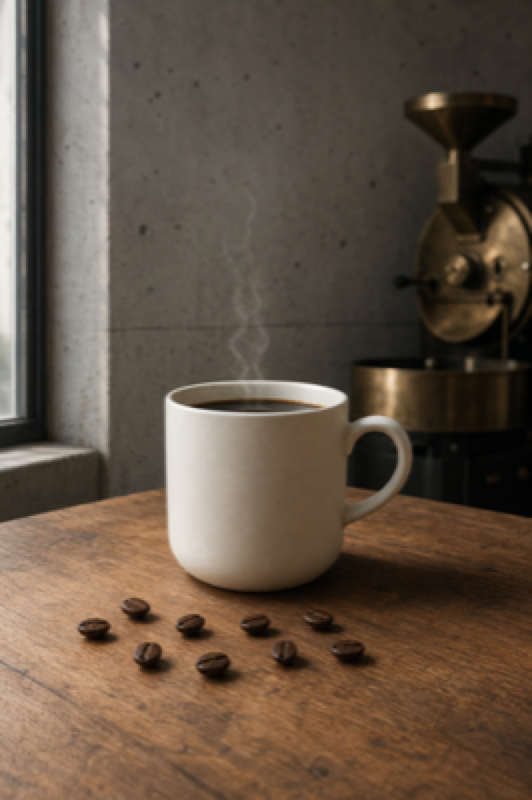
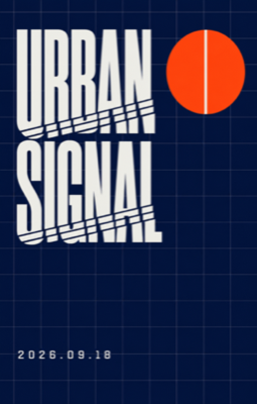
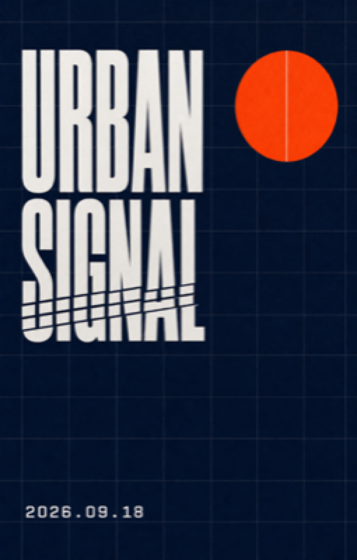
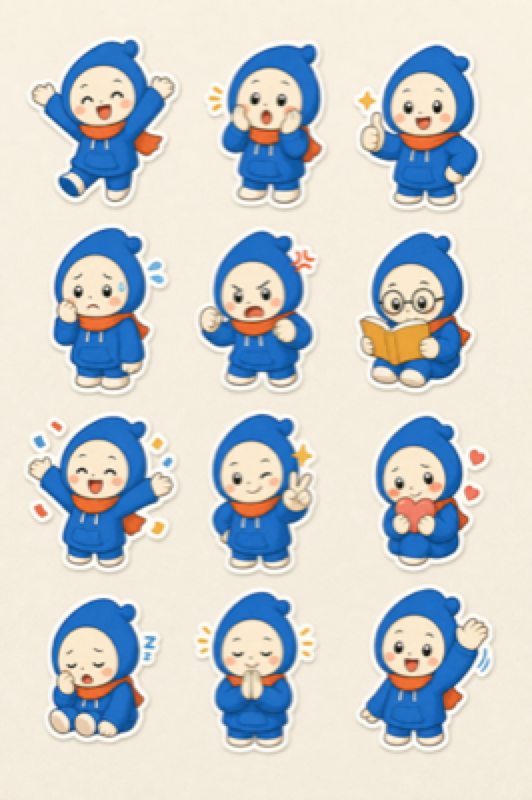
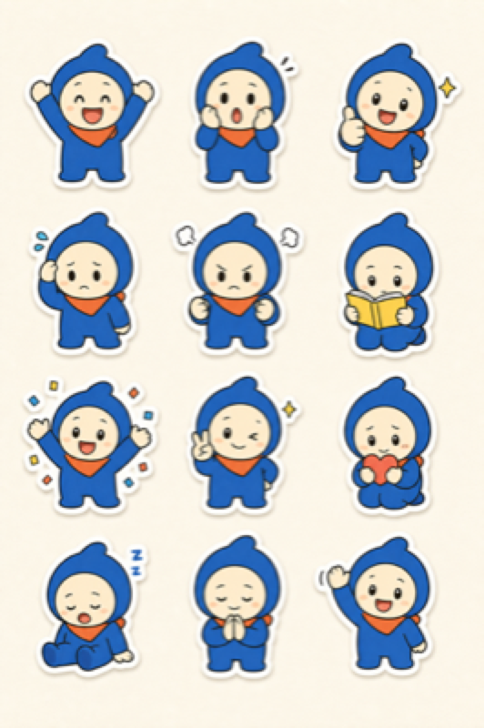

# 이미지 프롬프트 생성 방식 비교 실험

실험일: 2026-07-23

사용자 최종 판정: 제품 사진은 **A(현행 상세 구조화)**, 스티커는 **B(정체성 잠금 정제안)**.

## 결론

promptGen의 구조화 프롬프트를 전면 축약하면 안 된다. 제품 사진과 타이포 포스터에서 기존의 상세한 장면·배치·표면 계약이 더 높은 제약 준수율을 보였다. 특히 타이포 포스터의 짧은 정제안은 정확 문구는 지켰지만 대각 절개를 두 줄 전체가 아니라 `SIGNAL`에만 적용했다.

반면 여러 칸에서 하나의 정체성을 반복하는 스티커·캐릭터 시트·스토리보드는 프롬프트 앞부분의 짧은 잠금 규칙과 `quality high`가 유효했다. 따라서 전역 포맷은 유지하고 시리즈형 결과물에만 정체성·레이아웃·팔레트 잠금, 단일 변주축, 생성 후 QA를 추가하는 것이 적절하다.

## 비교 대상과 판정

| 항목 | promptGen | gongnyang-prompt-kit | ima2-gen | 판정 |
|---|---|---|---|---|
| 프롬프트 계약 | typed JSON, 엄격 검증, 구조화/에디토리얼 2개 프로필 | 6섹션/플랫 포맷, 강한 작성 규칙과 검증기 | 자연어 시스템 프롬프트와 프리셋 문자열 결합 | promptGen 유지 |
| 카탈로그 | 87개, family 충돌 방지, 실행 directive | 세밀한 카테고리·룩·개념축 | 카메라·스타일·조명 프리셋 | 현재 87개 구조 유지 |
| 변주 | 별도 생성 계획 없음 | 한 번에 한 축만 변경 | 수량 추론·병렬 fanout, 실제 문구는 “다른 구도”로 포괄적 | 공냥의 단일축 규칙 채택 |
| 연속성 | 구조화 필드가 호출 단위 권위 | persona/덱 DNA 반복 | style lock, subject lock, 현재 이미지 manifest | ima2의 잠금 개념만 채택 |
| 품질 판정 | 정적 validator 중심 | goal fit/text/material/layout 4축 QA | 생성 상태·오류·재시도·metadata | 공냥 QA + ima2 lineage 개념 채택 |
| 메타데이터 | request와 catalog entry 기록 | jsonl status/QA | user prompt, revised prompt, model, parent image 등 상세 lineage | 현재 metadata에 generation plan 추가 |

### 차용하지 않은 항목

- ima2의 style sheet 접두사: 팔레트·구도·무드·매체를 자연어 한 줄로 다시 붙여 현재 구조화 필드와 충돌하거나 중복될 수 있다.
- ima2의 일반형 variant 문구: `distinct composition`만 지시해 어떤 변수가 결과를 갈랐는지 추적하기 어렵다.
- gongnyang의 전면 축약 포맷: 타이포 처리와 세부 배치 준수율이 내려간 실험 결과 때문에 전역 적용하지 않는다.
- ima2의 provider·node graph·video 계층: 현재 promptGen의 단일 이미지 typed contract 범위를 벗어난다.

## 실제 생성 실험

동일한 세 과제에 대해 현행 컴파일 결과와 짧은 실행 우선순위형 정제안을 각각 한 번 생성했다. 점수는 5점 척도이며, 단일 샘플이므로 미세한 미감 차이는 확정적 통계가 아니라 방향 판단 자료다.

### 1. 제품 사진

| 버전 | 목표 적합 | 재질·매체 | 레이아웃 | 개수 준수 | 관찰 |
|---|---:|---:|---:|---:|---|
| 현행 구조화 | 5.0 | 5.0 | 4.6 | 5.0 | 원두 9알, 증기, 컵과 로스터 재질을 모두 지킴. 더 따뜻하고 에디토리얼한 분위기 |
| 짧은 정제안 | 5.0 | 5.0 | 4.8 | 5.0 | 원두 9알과 삼각형 위계가 더 명확. 컵이 더 크고 중심적 |

현행:

짧은 정제안:

판정: 사용자 선택은 **A(현행 구조화)**. 따뜻한 편집 사진의 분위기와 풍부한 장면 묘사를 제품 사진의 기준으로 유지한다. 전역 축약은 적용하지 않는다.

### 2. 타이포 포스터

| 버전 | 목표 적합 | 문구 정확 | 재질·매체 | 레이아웃 | 관찰 |
|---|---:|---:|---:|---:|---|
| 현행 구조화 | 5.0 | 5.0 | 4.7 | 5.0 | `URBAN`과 `SIGNAL` 모두 대각 절개, 날짜 정확, 신호 원판과 격자 정확 |
| 짧은 정제안 | 4.2 | 5.0 | 4.7 | 3.8 | 날짜·문구는 정확하지만 대각 절개가 사실상 `SIGNAL`에만 적용 |

현행:

짧은 정제안:

판정: 현행 구조화 프롬프트 승리. 정확 문구만이 아니라 treatment 범위까지 반복적으로 구조화한 것이 유효했다.

### 3. 12종 스티커

| 버전 | 목표 적합 | 정체성 | 레이아웃 | 행동 매핑 | 관찰 |
|---|---:|---:|---:|---:|---|
| 현행 구조화 | 4.8 | 4.7 | 4.9 | 4.8 | 12칸과 주요 행동을 모두 표현. 묘사가 풍부하지만 집중 캐릭터에 안경을 추가하는 등 세부 변동이 있음 |
| 잠금 정제안 | 5.0 | 5.0 | 5.0 | 5.0 | 얼굴·후드·스카프와 크기가 더 균일하고 12개 행동 순서가 더 명확. 표현은 조금 단순함 |

현행:

잠금 정제안:

판정: 사용자 선택은 **B(잠금 정제안)**. 스티커·캐릭터 시리즈에서는 표현의 복잡도보다 얼굴·복장·색 역할·크기·행동 매핑의 일관성을 우선한다.

## 구현에 반영한 규칙

1. 기존 구조화 프롬프트의 섹션과 권위 규칙은 유지한다.
2. `P1`, `P2`, `P7`, `C10`처럼 여러 칸의 연속성이 중요한 결과물은 `quality high`를 기본으로 한다.
3. 스티커는 얼굴 기하·기준 실루엣·복장·액세서리·선 굵기·팔레트 역할을 잠근다.
4. 스티커의 표정·행동 목록은 프롬프트에 한 번만 전체 표기하고, 제약 섹션에서는 개수와 읽기 순서만 참조한다.
5. 비교 생성은 변주축 하나만 바꾸고 나머지는 잠근다.
6. 생성 후 `목표 적합`, `문구 정확`, `재질·매체`, `레이아웃` 네 항목을 함께 확인한다.
7. brief가 바뀌면 이전 질문·추론·결과 계약을 폐기해 서로 다른 작업의 답변이 섞이지 않게 한다.

## 검증 상태

- promptGen: 전체 Rust 테스트 통과. 병렬 전체 실행에서 기존 timeout 테스트가 한 차례 version probe로 간헐 실패했으나 해당 테스트 단독 실행은 통과했다. 최종 검증은 단일 스레드 전체 실행으로 고정한다.
- gongnyang prompt validator: 16/16 fixture 통과.
- ima2 focused tests: 의존성 및 TypeScript 빌드 산출물이 없는 원본 폴더라 `config.js`, `agentTypes.js` 모듈 부재로 실행 불가. 정적 소스와 테스트 계약은 검토했다.
